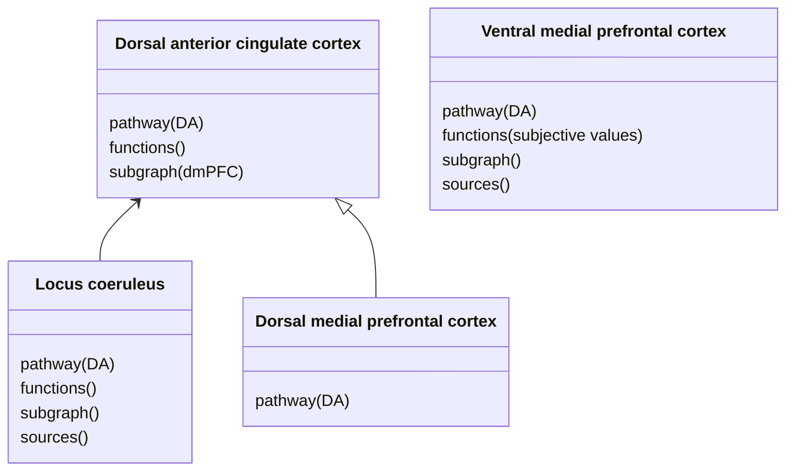

# NeuroGraph
Graph to summarise brain regions and their functions

## Example

---

# References
* [Mermaid diagram](https://mermaid.js.org/syntax/classDiagram.html)
* [Silvetti et al. (2018)](https://dx.plos.org/10.1371/journal.pcbi.1006370)
* [Yao et al. (2023)](https://doi.org/10.1016/j.neuroimage.2023.120326)
