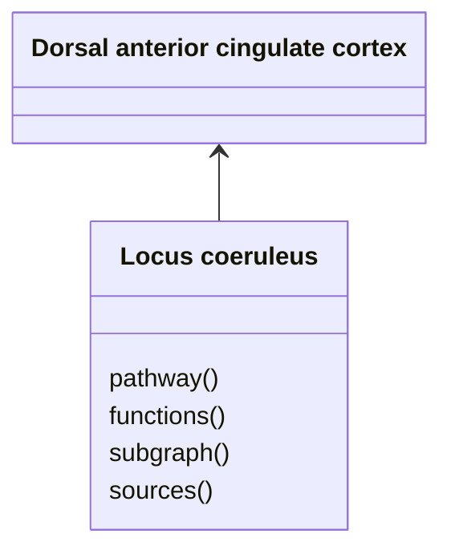

# NeuroGraph
Graph to summarise brain regions and their functions

## Example

```mermaid
classDiagram
    dACC <-- LC
    class LC["Locus coeruleus"]{
        pathway()
        functions()
        subgraph()
        sources()
    }
    class dACC["Dorsal anterior cingulate cortex"]{
        
    }
```

---

# References
* [Silvetti et al. (2018)](https://dx.plos.org/10.1371/journal.pcbi.1006370)
* 